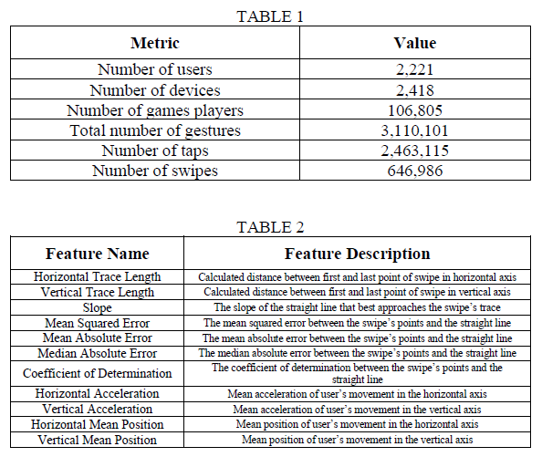
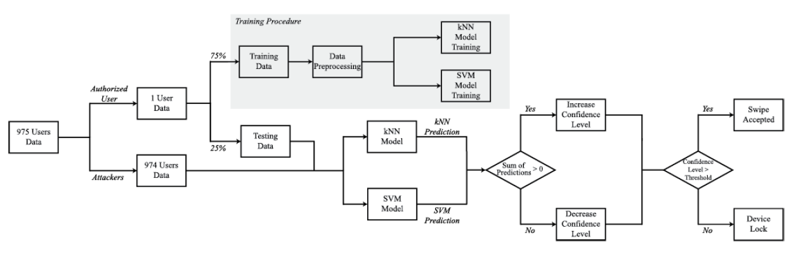
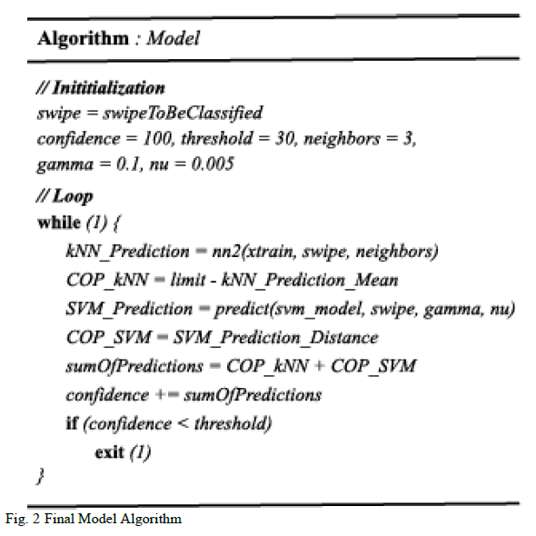
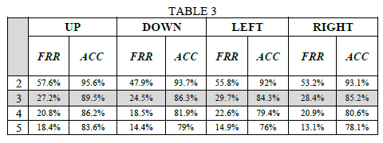
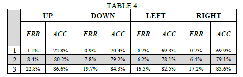
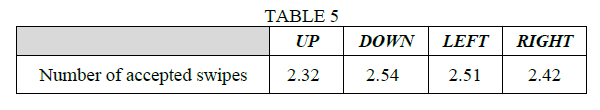

# A combined kNN-SVM confidence-based algorithm for Continuous Implicit Authentication in Smartphone Applications

"Abstract — Due to the dramatic increase in popularity of smart-phones in the past decade, the need for sophisticated patterns that provide user authentication and security of sensitive information is growing. Towards this goal, a variety of biometrics has been applied in the past few years, such as user password, face recognition or fingerprint in order to access the device. In this work we propose a different approach. A continuous implicit authentication model that recognizes the authenticated user in real time, while using their device, through their swiping behavior. To meet this target, a one-class kNN-SVM confidence-based model was created and tested in a quite representative dataset which consists of 975 different users."

In the goal of creating this representative dataset, Papamichail et al. [8] developed “BrainRun” which, as we said before, is a commercially available application and consists of a number of games aiming at boosting cognitive skills of the users. More precisely, BrainRun consists of 5 different games (“Focus”, “Mathisis”, “Memoria”, “Reacton”, “Speedy”). Each game has a different set of rules and it is designed in a way that can provide us with a different set of user gestures such as horizontal swipes, vertical swipes, taps etc. In Table 1 we can see the statistics of the dataset created from the application “BrainRun”. Despite the fact that the dataset contains both taps and swipes of different users, in this work we only use the swipes of each user, both for simplicity reasons of the training procedure of the model and because the swiping behavior of a user gives us more information about the way they interface with their smartphone.

Then, after collecting the swipes from these users, we calculated some features in order to better understand the swiping behavior of each user. These features are shown in Table 2.

An overview of the system is shown in Figure 1. More precisely, as we said before we use the method “one against the universe” so we split the data of the user who we assumed as the legitimate user and all the other data are assumed as “attacker” swipes. Following, we split the user data into training data, which will be used in order to train our model, and testing data, which will be used in order to test if our model recognizes the user correctly. On the other hand, we use the “attackers” data with the purpose of testing if our model can recognize that the person using the smartphone is not an authorized user. The training-testing partition is 75%-25% respectively and we implemented that in R Programming Language with the floor() and sample() functions which assure a non-deterministic way of partitioning. Then, before training our model, we preprocess the training data, since the dataset derives from a real-world application and there are a lot of Outliers which can alter the outcome of the classification. As shown in Figure 1, we used an ensemble method for the classification, in which there are two different models, a kNN model and an SVM model, that give two different prediction results and we summarize those predictions, creating a more accurate final prediction. After calculating the predictions of our models, we introduced to our system a confidence variable which boosted the accuracy of our system.

Following, in Figure 2 we can see the final model in pseudocode with some R functions, nn2() and predict() needed for the prediction of the kNN and SVM models respectively.

First, we run only the kNN model in order to establish the nearest neighbors of the final model. Towards that goal, we run 50 times (for 50 different users) the kNN model for 2-5 nearest neighbors and we evaluated the results. The results are shown in Table 3. As we can see, while the Accuracy of the model with 2 nearest neighbors is very good, the FRR of our model is significant. On the other hand, with 5 nearest neighbors, the model has very good FRR but low Accuracy. Thus, we chose our final model to have 3 nearest neighbors. So, the kNN model has a total Accuracy of about 86.3% and total FRR of about 27.4%.

The same way, in order to define the parameters of the final SVM model we run for 50 different users the SVM model for different parameters. For simplicity reasons, we present the results of 3 ν-γ pairs. In Table 4 we can see the results. As we can see, while the pair 1 (0.005-0.01) has very low FRR, the total Accuracy is also low and while the pair 3 (0.005-0.2) has high total Accuracy, the FAR is also high. So, we chose the pair 2 (0.005-0.1).

As we said before, although the models by themselves have a high Accuracy, the FRR and FAR of the models cannot be ignored. Thus, we inserted to our system the confidence value and the COP value. Now, instead of locking the phone instantly in case of a misclassification, when the authenticated user operates the smartphone, or the other way around, the confidence value will change according to the COP value. So, the metric used for evaluating the model is the number of swipes that the “attacker” did before the device locks. Also, we evaluate if the device locks when the authenticated user operates the device. In Table 5 we can see the results for all directions of swipes. Again, in those results are the mean value of 50 different users that was tested for each direction. From the following results for every direction, we can say that the total number of accepted swipes of our model is about 2.44 swipes.

