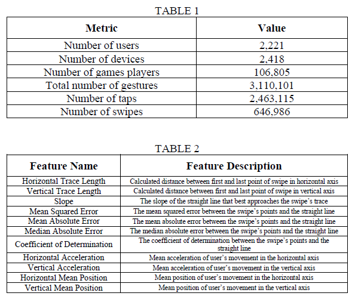

### Continous-Implicit-Authentication-for-Smartphone-Applications

"Abstract — Due to the dramatic increase in popularity of smart-phones in the past decade, the need for sophisticated patterns that provide user authentication and security of sensitive information is growing. Towards this goal, a variety of biometrics has been applied in the past few years, such as user password, face recognition or fingerprint in order to access the device. In this work we propose a different approach. A continuous implicit authentication model that recognizes the authenticated user in real time, while using their device, through their swiping behavior. To meet this target, a one-class kNN-SVM confidence-based model was created and tested in a quite representative dataset which consists of 975 different users."

